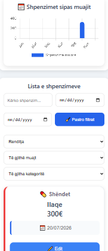

# 💰 Expense Tracker

Një aplikacion **full-stack** për menaxhimin e shpenzimeve personale.

Expense Tracker lejon përdoruesin të regjistrojë, menaxhojë dhe analizojë shpenzimet e tij përmes një ndërfaqeje moderne dhe responsive.

---

## 🚀 Features

✅ Shtimi i shpenzimeve  
✅ Editimi i shpenzimeve  
✅ Fshirja e shpenzimeve  
✅ Kërkimi i shpenzimeve  
✅ Filtrimi sipas kategorive  
✅ Filtrimi sipas datës dhe muajit  
✅ Dashboard me statistika  
✅ Grafikë të shpenzimeve  
✅ Menaxhim i buxhetit  
✅ Përqindja e përdorimit të buxhetit  
✅ Dark Mode  
✅ Dizajn responsive për telefon dhe desktop  
✅ Export i të dhënave CSV  

---

## 📸 Screenshot

---

## 🌐 Live Demo

https://expense-tracker-d5llisutk-erlindacodes1.vercel.app

---

## 🛠️ Technologies

### Frontend

- React
- Vite
- CSS
- Chart.js

### Backend

- Node.js
- Express.js
- MySQL

---

## 📂 Project Structure

---

## ⚙️ Installation

### 1. Clone repository

